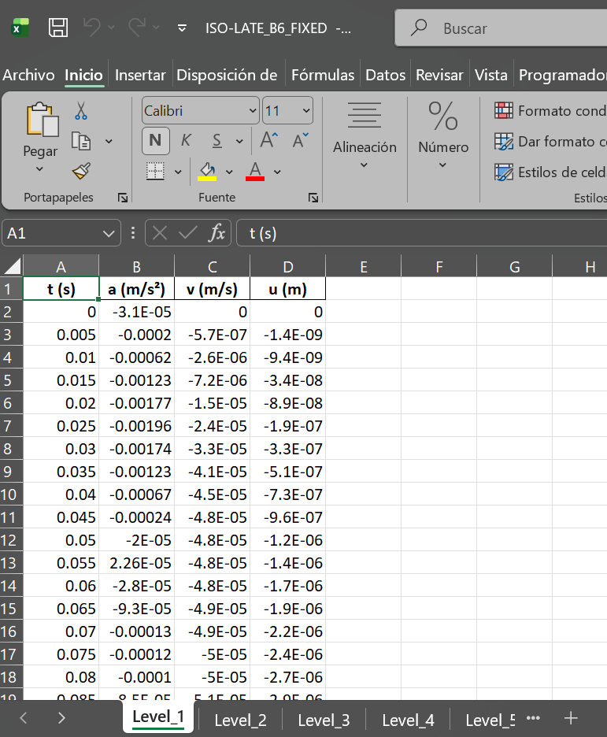
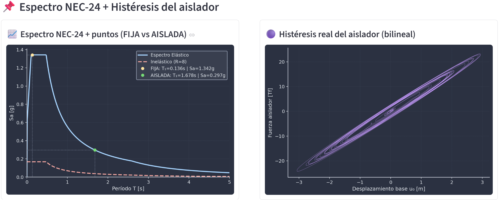

💻 ISO-LATE  
### *Herramienta Interactiva para Análisis Estructural – Base Fija vs Aislamiento Sísmico*

<p align="center">
  
</p>

<p align="center">
  <b>ISO-LATE</b> es una aplicación de ingeniería interactiva desarrollada para <b>simular, analizar y comparar la respuesta sísmica de estructuras 2D</b> con <b>base fija</b> y <b>sistemas con aislamiento sísmico en la base</b>.
</p>

---

## 📌 Tabla de Contenidos
- [Descripción General](#descripcion-general)
- [Características Principales](#caracteristicas-principales)
- [Alcance de Ingeniería](#alcance-de-ingenieria)
- [Fundamento Teórico](#fundamento-teorico)
- [Estructura de la Aplicación](#estructura-de-la-aplicacion)
- [Manual de Usuario](#manual-de-usuario)
- [Validación y Limitaciones](#validacion-y-limitaciones)
- [Tecnologías Utilizadas](#tecnologias-utilizadas)
- [Autor y Contexto Académico](#autor-y-contexto-academico)
- [Licencia](#licencia)

---

## 🧭 Descripción General

**ISO-LATE** es una herramienta educativa y orientada a la ingeniería que permite a los usuarios:

- Modelar **estructuras aporticadas 2D de múltiples niveles**
- Realizar **análisis dinámico lineal**
- Comparar el comportamiento estructural entre sistemas de **base fija** y **base aislada**
- Visualizar **métricas de respuesta sísmica** de forma clara e intuitiva
- Entender las diferencias y ventajas del uso de **sistemas de aislamiento**

---

## ✨ Características Principales

✔️ Definición paramétrica de estructuras 2D  
✔️ Generación automática de matrices de masa y rigidez  
✔️ Análisis modal y análisis por espectro de respuesta  
✔️ Análisis en el dominio del tiempo mediante el método **Newmark-β**  
✔️ Modelado de aislamiento sísmico (LRB / NRB – equivalente lineal)  
✔️ Comparación lado a lado: **Base Fija vs Base Aislada**  
✔️ Gráficos técnicos limpios y escalables  
✔️ Interfaz interactiva basada en Streamlit 

---

## 🏗️ Alcance de Ingeniería

La aplicación se enfoca en:

- Comportamiento **elástico lineal**
- Estructuras planas (2D)
- Idealización tipo **shear-building**
- Modelado equivalente lineal para aisladores sísmicos
- Uso educativo y comparativo (no destinado a diseño estructural final)

> ⚠️ **ISO-LATE no está diseñado para reemplazar software profesional de análisis no lineal avanzado**.

---

## 📐 Fundamento Teórico

La formulación principal se basa en:

- Análisis matricial de estructuras
- Ecuación de movimiento para sistemas de múltiples grados de libertad (MDOF):

$$
\mathbf{M}\ddot{\mathbf{u}} + \mathbf{C}\dot{\mathbf{u}} + \mathbf{K}\mathbf{u} = -\mathbf{M}\mathbf{r}\ddot{u}_g
$$

- **M** = matriz de masa del sistema  
- **C** = matriz de amortiguamiento  
- **K** = matriz de rigidez  
- **u** = vector de desplazamientos relativos respecto al terreno  
- **u̇** = vector de velocidades relativas  
- **ü** = vector de aceleraciones relativas  
- **u<sub>g</sub>̈** = aceleración del terreno (registro sísmico)  
- **r** = vector de influencia sísmica (usualmente un vector de unos que indica cómo la aceleración del terreno afecta a cada grado de libertad)

El término del lado derecho representa las fuerzas inerciales inducidas por la aceleración del terreno sobre la masa estructural.

---

### Interpretación Física

- El primer término representa las fuerzas inerciales internas.
- El segundo término corresponde a la disipación de energía por amortiguamiento.
- El tercer término describe la respuesta elástica del sistema.
- El término del lado derecho modela la excitación sísmica impuesta por el movimiento del suelo.

ISO-LATE resuelve esta ecuación utilizando:

- Superposición modal (para análisis espectral)
- Amortiguamiento de Rayleigh
- Integración numérica mediante el método de **Newmark-β**

### Referencias Técnicas

- Chopra, A.K. – *Dynamics of Structures*  
- ASCE 7 / ASCE 41  
- FEMA 440 / FEMA P-1050  

---

## 🧩 Estructura de la Aplicación

```text
ISO-LATE/
│
├── app.py                     # Aplicación principal en Streamlit
├── funciones_usuario.py       # Funciones de modelado estructural y análisis dinámico
├── requirements.txt           # Dependencias de Python
├── .streamlit/
│   └── config.toml            # Configuración visual y del servidor
├── assets/                    # Imágenes, logotipos e íconos
│   └── logo.png
├── data/                      # Registros sísmicos (opcional)
└── README.md                  # Documentación del proyecto
```
---

---

## 📘 Manual de Usuario

La aplicación inicia con una ventana principal en la cual el usuario debe seleccionar el idioma de trabajo: inglés (**en**) o español (**es**).  

Posteriormente se ingresan los parámetros generales del modelo estructural, incluyendo:

- Geometría
- Secciones estructurales
- Propiedades de materiales
- Cargas consideradas en el análisis

<p align="center">
  <br>
  <em>Figura 1 – Pantalla inicial y definición de parámetros generales.</em>
</p>

---

### 🔹 Definición geométrica y estructural del modelo

Una vez definidos los parámetros iniciales, se debe presionar el botón **"Generar modelo estructural"**.

En esta sección se habilitan los siguientes apartados:

- **Resumen del modelo**, donde se indican:
  - Número de nodos
  - Número de elementos
  - Grados de libertad (GDL)

El modelo asigna un **diafragma rígido por piso**, lo que implica:

- Un único grado de libertad horizontal **UX** por nivel.
- Los grados de libertad **UY** y **θ** se mantienen por nodo.

Posteriormente, el programa realiza la **condensación de la matriz global**, dejando únicamente un grado de libertad horizontal (**UX**) por planta.

En esta sección también se pueden visualizar:

- Matriz global de rigidez
- Matriz global de masa
- Matriz de transformación
- Matrices condensadas **K** y **M**

Además, existe una pestaña de **chequeo rápido**, donde se verifican las rigideces por nivel comparándolas con la expresión aproximada:

$$
\frac{12EI}{L^3}
$$

<p align="center">
  <br>
  <em>Figura 2 – Resumen del modelo y matrices condensadas.</em>
</p>

---

### 🔹 NEC-24 + Registro Sísmico

En esta sección se definen los parámetros correspondientes al espectro de diseño basado en la **Normativa NEC-24**.

El programa:

- Genera automáticamente el gráfico del espectro
- Indica los coeficientes normativos utilizados
- Muestra las aceleraciones espectrales en meseta y en 1 segundo

Además, se carga el registro sísmico para el análisis comparativo.

El usuario puede:

- Cargar un archivo en formato **.TXT** o **.AT2**
- Utilizar el botón **"Usar ejemplo por defecto"**

ISO-LATE soporta registros con formato compatible con:

- **RENAC (Red Nacional de Acelerógrafos)**
- **PEER Ground Motion Database**

Una vez cargado el registro, el usuario puede:

- Usar el registro crudo
- Filtrar y corregir la línea base para obtener una señal limpia

<p align="center">
  <br>
  <em>Figura 3 – Definición de espectro NEC-24 y carga de registro sísmico.</em>
</p>

---

### 🔹 Escalamiento del Espectro

El programa genera automáticamente el **espectro de respuesta del registro ingresado**.

El usuario puede:

- Escalar el registro al espectro NEC-24
- Elegir entre espectro elástico o inelástico
- Definir el amortiguamiento del espectro

<p align="center">
  <br>
  <em>Figura 4 – Espectro del registro y opciones de escalamiento.</em>
</p>

---

### 🔹 Diseño del Aislador LRB y Curva de Histéresis

En esta sección el usuario puede diseñar el aislador sísmico tipo **LRB (Lead Rubber Bearing)** que será utilizado en la comparación entre sistema fijo y aislado.

El diseño puede realizarse mediante dos procedimientos:

1. **Automático**
   - Basado en los lineamientos de ASCE 7 – Capítulo 17.
   - Genera propiedades del aislador conforme a criterios normativos.

2. **Por período objetivo**
   - Se define un período objetivo para el sistema aislado.
   - El proceso está limitado hasta 5 segundos.
   - El sistema advierte cuando el período seleccionado es demasiado bajo y no genera un aislamiento efectivo.

Como resultado del diseño se obtienen:

- Propiedades lineales
- Propiedades no lineales
- Rigidez efectiva
- Desplazamiento de diseño
- Energía disipada
- Curva bilineal de histéresis

Además, se realizan verificaciones básicas para comprobar que el aislador cumple con un comportamiento coherente en términos de rigidez, desplazamiento y disipación de energía.

<p align="center">
  <br>
  <em>Figura – Diseño del aislador LRB y curva de histéresis bilineal.</em>
</p>

---

### 🔹 Análisis Modal

Se realiza el análisis modal tanto para:

- Sistema de base fija
- Sistema aislado

Incluye:

- Matrices condensadas
- Frecuencias naturales
- Períodos modales

<p align="center">
  <br>
  <em>Figura 7 – Resultados del análisis modal.</em>
</p>

---

### 🔹 Modos Normalizados

Se muestra el esquema normalizado de cada modo de vibración junto con su período correspondiente.

<p align="center">
  <br>
  <em>Figura 8 – Formas modales normalizadas.</em>
</p>

---

### 🔹 Esquema de Péndulo Invertido

Se presenta un gráfico esquemático donde se resumen:

- Rigideces por piso
- Masas por piso

Unidades:

- Rigidez: **Tf/m**
- Masa: **Tf·s²/m**

<p align="center">
  <br>
  <em>Figura 9 – Esquema tipo péndulo invertido.</em>
</p>

---

### 🔹 Análisis Dinámico (Newmark-β)

Se realiza el análisis dinámico en el dominio del tiempo para:

- Sistema fijo lineal
- Sistema aislado lineal

El programa:

- Calcula amortiguamiento Rayleigh (5%)
- Obtiene coeficientes α y β
- Resuelve mediante método Newmark-β
- Genera respuestas en:
  - Aceleración
  - Velocidad
  - Desplazamiento

Todos los gráficos son desplegables.

Los resultados pueden descargarse en formato Excel.

<p align="center">
  <br>
  <em>Figura 10 – Respuestas dinámicas y descarga de resultados.</em>
</p>

---

Cada pestaña del archivo exportado contiene:

- Tiempo de análisis
- Respuesta por nivel

<p align="center">
  <br>
  <em>Figura 11 – Exportación de resultados por nivel.</em>
</p>

---

### 🔹 Espectro NEC-24 + Histéresis del Aislador

En el lado izquierdo:

- Espectro NEC-24
- Ubicación del punto correspondiente al primer período del sistema fijo y aislado
- Aceleración espectral asociada

En el lado derecho:

- Histéresis del aislador
- Análisis no lineal tiempo-historia
- Adaptación de rigidez en función del desplazamiento

<p align="center">
  <br>
  <em>Figura 12 – Espectro normativo e histéresis no lineal.</em>
</p>

---

## 🧪 Validación y Limitaciones

### 🔹 Proceso de Validación

### 🔹 Comparación con Software Especializado

### 🔹 Supuestos del Modelo

### 🔹 Limitaciones Numéricas y Teóricas

---

## 🛠️ Tecnologías Utilizadas

---

## 🎓 Autor y Contexto Académico

---

## 📄 Licencia
