# 🇬🇧 ENGLISH VERSION
# 💻 ISO-LATE  
### Interactive Tool for Structural Analysis – Fixed Base vs Seismic Isolation

<p align="center">
  
</p>

<p align="center">
  <b>ISO-LATE</b> is an interactive engineering application developed to <b>simulate, analyze, and compare the seismic response of two-dimensional structures</b> with a <b>fixed base</b> and <b>base isolation systems</b>.
</p>

<p align="center">
  🌐 <a href="https://iso-late.streamlit.app/" target="_blank"><b>Open Live Application</b></a>
</p>

---

## 📌 Table of Contents

- [General Description](#general-description)
- [Key Features](#key-features)
- [Engineering Scope](#engineering-scope)
- [Theoretical Background](#theoretical-background)
- [Application Structure](#application-structure)
- [User Manual](#user-manual)

---

## 🧭 General Description

ISO-LATE is an educational and engineering-oriented platform that enables users to:

- Model multi-story two-dimensional frame structures.
- Perform linear dynamic analysis.
- Compare the structural response between fixed-base and base-isolated systems.
- Visualize seismic response parameters in a clear and structured format.
- Understand the mechanical and dynamic effects of seismic isolation systems.

The tool is designed for academic, research, and comparative purposes, facilitating conceptual understanding of structural dynamic behavior.

---

## ✨ Key Features

- Parametric definition of two-dimensional structures.
- Automatic generation of global and condensed mass and stiffness matrices.
- Matrix condensation to one horizontal degree of freedom per story.
- Modal analysis including natural frequencies and modal periods.
- Response Spectrum Analysis using modal superposition.
- Time-History Analysis using the Newmark-β numerical integration method.
- Linear-equivalent modeling of Lead Rubber Bearings and Natural Rubber Bearings.
- Direct comparison between fixed-base and base-isolated systems.
- Clean, scalable engineering plots and exportable tables.
- Excel export functionality for structural response results.

---

## 🏗 Engineering Scope

The application considers:

- Linear elastic structural behavior.
- Two-dimensional planar structural modeling.
- Shear-building idealization with one horizontal degree of freedom per story.
- Linear-equivalent modeling of seismic isolators.
- Educational and comparative analysis purposes.

> ISO-LATE is not intended to replace professional nonlinear structural analysis software or to be used for final structural design.

---

## 📐 Theoretical Background

The structural formulation is based on matrix structural dynamics and the governing equation of motion for multi-degree-of-freedom systems:

$$
\mathbf{M}\ddot{\mathbf{u}} + \mathbf{C}\dot{\mathbf{u}} + \mathbf{K}\mathbf{u} = -\mathbf{M}\mathbf{r}\ddot{u}_g
$$

Where:

- **M** is the mass matrix.
- **C** is the damping matrix.
- **K** is the stiffness matrix.
- **u** is the relative displacement vector.
- **u̇** is the relative velocity vector.
- **ü** is the relative acceleration vector.
- **üg** is the ground acceleration record.
- **r** is the seismic influence vector.

The right-hand term represents inertial forces induced by ground acceleration acting on the structural mass.

ISO-LATE solves this equation using:

- Modal superposition for spectral analysis.
- Rayleigh damping formulation.
- Newmark-β time integration method for time-history analysis.

### Technical References

- Chopra, A.K. – *Dynamics of Structures*  
- ASCE 7  
- NEC24  

---

## 🧩 Application Structure

```text
ISO-LATE/
│
├── app.py
├── funciones_usuario.py
├── requirements.txt
├── .streamlit/
│   └── config.toml
├── assets/
│   └── logo.png
├── data/
└── README.md
```

---

## 📘 User Manual

ISO-LATE is organized in sequential blocks that guide the user through the complete modeling and analysis workflow.

Each stage progressively builds the comparison between a fixed-base system and a base-isolated system.

---

### 1. Initial Model Definition

The user defines:

- Number of stories and bays.
- Story height and bay length.
- Section geometry or mechanical properties.
- Material properties.
- Load parameters.

If Advanced Mode is activated, the user directly inputs:

- Cross-sectional area.
- Moment of inertia.

<p align="center">
  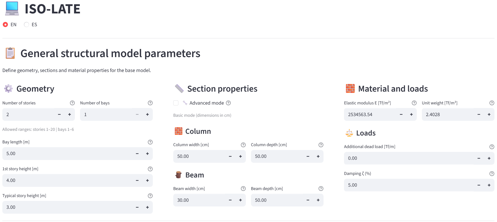
</p>

---

### 2. Structural Model Generation

The program automatically generates:

- Nodes.
- Structural elements.
- Degrees of freedom.
- Rigid diaphragm per story.
- Global mass and stiffness matrices.
- Condensed system matrices.

Stiffness validation includes the reference expression:

$$
\frac{12EI}{L^3}
$$

<p align="center">
  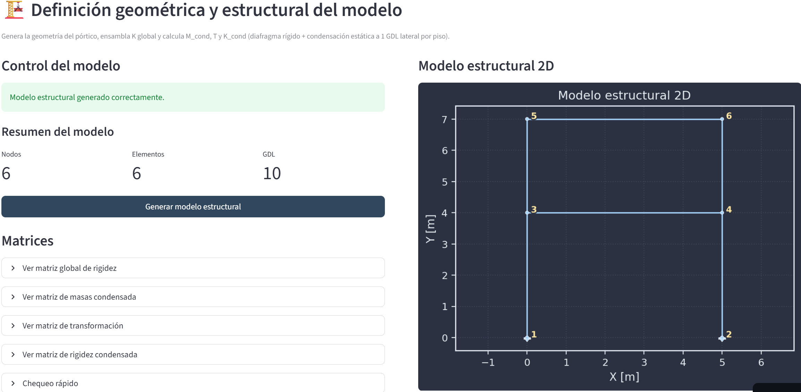
</p>

---

### 3. NEC-24 Spectrum and Ground Motion

- Automatic generation of the NEC-24 design spectrum.
- Seismic record loading in TXT or AT2 format.
- Optional baseline correction and filtering.
- Compatibility with RENAC and PEER databases.

<p align="center">
  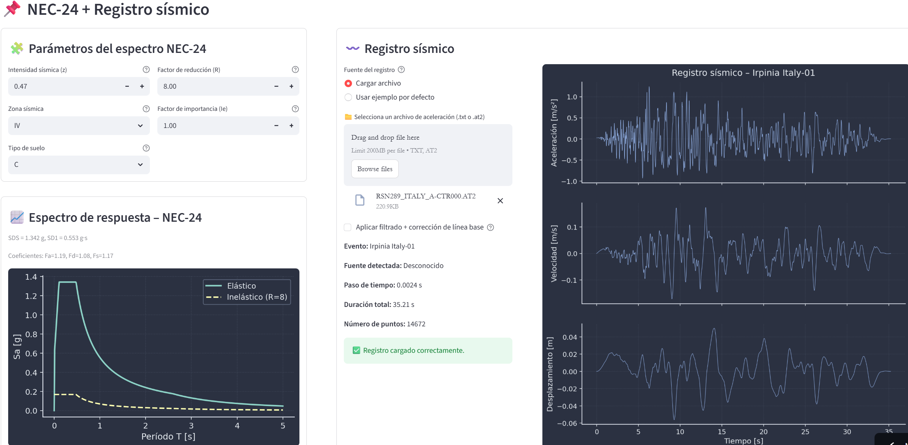
</p>

---

### 4. Record Scaling

- Scaling of the seismic record to match the NEC-24 target spectrum.
- Elastic or inelastic spectrum selection.
- Damping ratio definition.

<p align="center">
  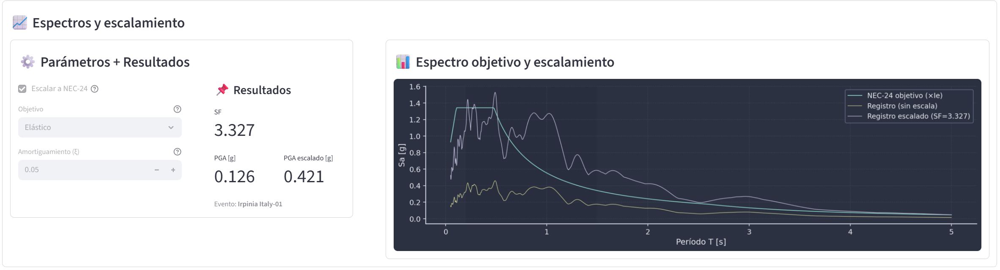
</p>

---

### 5. LRB Isolator Design

Two design methods are available:

- Automatic method based on ASCE 7 Chapter 17.
- Target period method (up to 5 seconds).

Outputs include:

- Effective stiffness.
- Design displacement.
- Energy dissipation.
- Bilinear hysteresis representation.

<p align="center">
  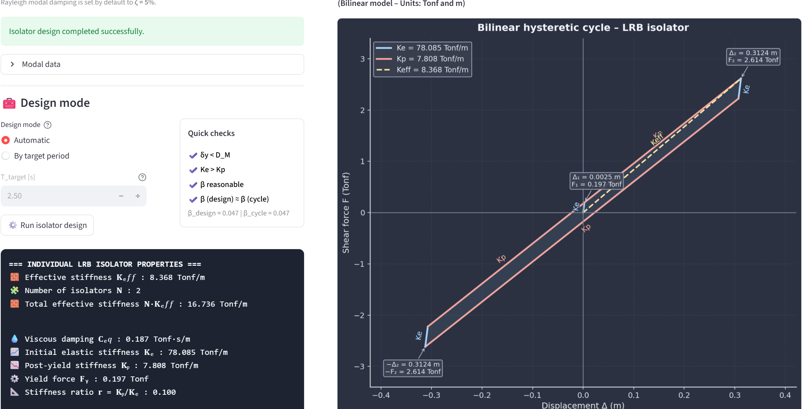
</p>

---

### 6. Modal Analysis

Performed for:

- Fixed-base system.
- Base-isolated system.

Displays:

- Natural frequencies.
- Modal periods.
- Mode shapes.

<p align="center">
  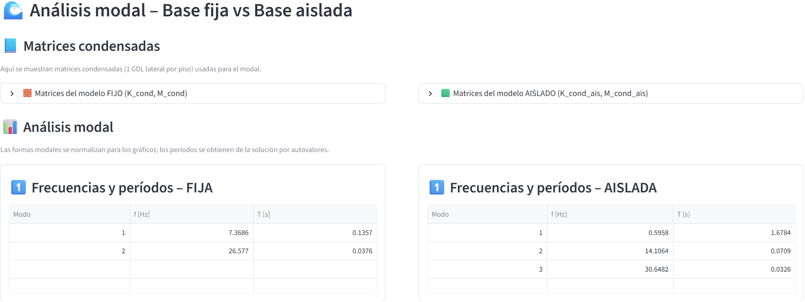
</p>

---

### 7. Normalized Mode Shapes

Graphical representation of normalized vibration modes.

<p align="center">
  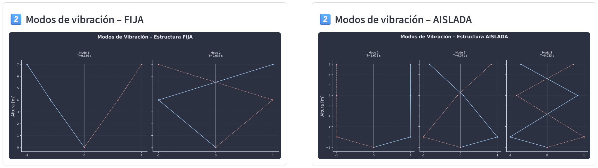
</p>

---

### 8. Inverted Pendulum Representation

Summary of:

- Story stiffness values.
- Story mass distribution.

<p align="center">
  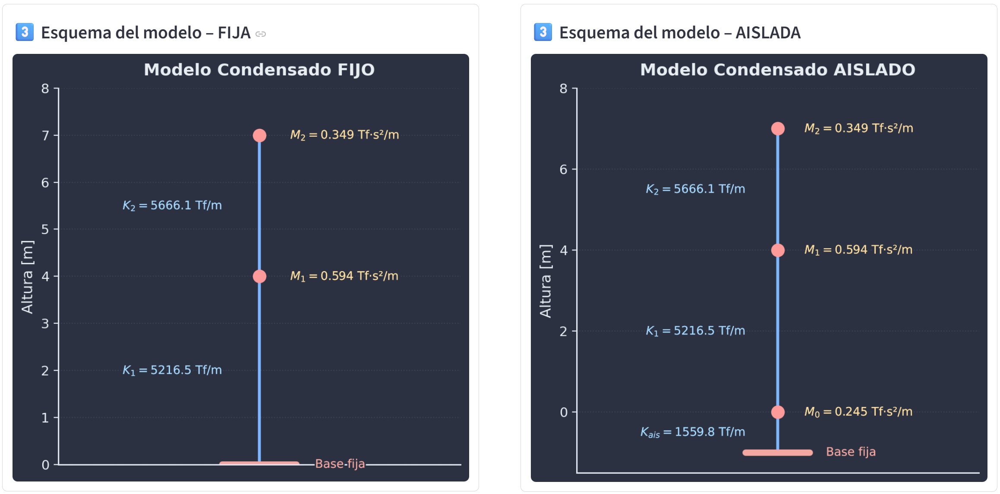
</p>

---

### 9. Dynamic Analysis – Newmark-β

Time-history analysis is performed for both structural configurations.

The program:

- Computes Rayleigh damping.
- Determines α and β coefficients.
- Solves the equation of motion.
- Generates acceleration, velocity, and displacement time histories.

Results can be exported to Excel format.

<p align="center">
  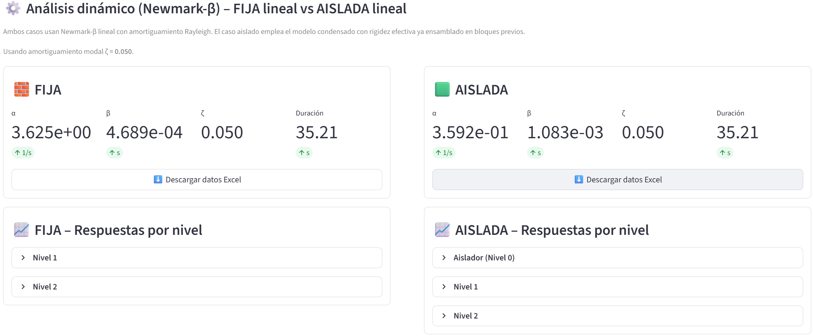
</p>

---

### 10. Story Shears

Shear forces are obtained using:

- Response Spectrum Analysis with modal combination.
- Time-History Analysis including maximum, minimum, and absolute values.

<p align="center">
  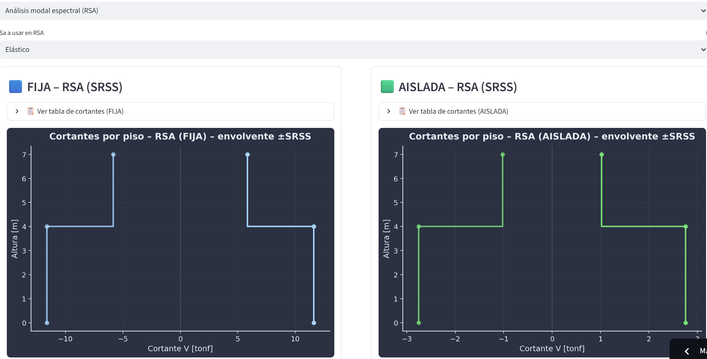
</p>

---

### 11. Lateral Displacements

Computed using:

- Response Spectrum Analysis.
- Time-History Analysis.

<p align="center">
  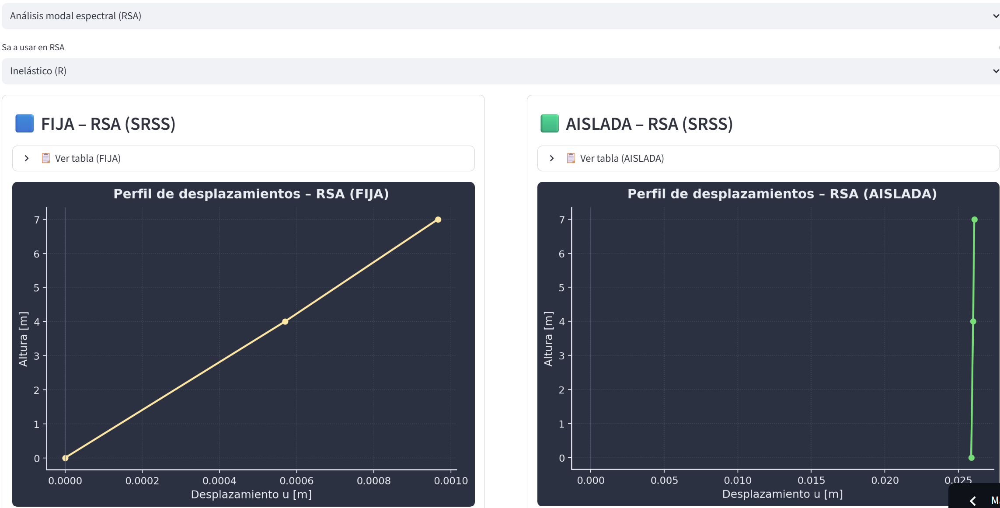
</p>

---

### 12. Interstory Drifts

Two drift definitions are available:

Real drift:

$$
\frac{|\Delta|}{h}
$$

Code-based drift according to NEC-24:

$$
\frac{C_d |\Delta|}{h I}
$$

<p align="center">
  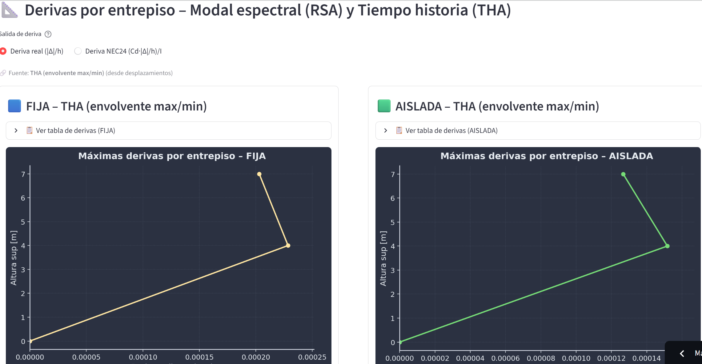
</p>

---

### 13. Final Comparison – Fixed Base vs Base Isolated

Overlay comparison of:

- Story shears.
- Lateral displacements.
- Interstory drifts.

Includes quantitative indicators of isolation efficiency.

<p align="center">
  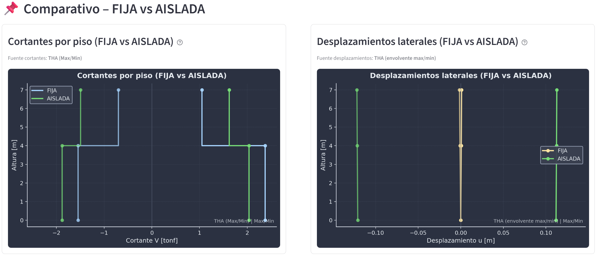
</p>

# 🇪🇸 VERSIÓN EN ESPAÑOL

# 💻 ISO-LATE  
### Herramienta Interactiva para Análisis Estructural – Base Fija vs Aislamiento Sísmico

<p align="center">
  
</p>

<p align="center">
  <b>ISO-LATE</b> es una aplicación de ingeniería interactiva desarrollada para <b>simular, analizar y comparar la respuesta sísmica de estructuras bidimensionales</b> con <b>base fija</b> y <b>sistemas con aislamiento sísmico en la base</b>.
</p>

<p align="center">
  🌐 <a href="https://iso-late.streamlit.app/" target="_blank"><b>Acceder a la Aplicación en Línea</b></a>
</p>

---

## 📌 Tabla de Contenidos

- [Descripción General](#descripcion-general)
- [Características Principales](#caracteristicas-principales)
- [Alcance de Ingeniería](#alcance-de-ingenieria)
- [Fundamento Teórico](#fundamento-teorico)
- [Estructura de la Aplicación](#estructura-de-la-aplicacion)
- [Manual de Usuario](#manual-de-usuario)

---

## 🧭 Descripción General

ISO-LATE es una plataforma educativa y orientada a la ingeniería estructural que permite:

- Modelar estructuras aporticadas bidimensionales de múltiples niveles.
- Realizar análisis dinámico lineal.
- Comparar la respuesta estructural entre sistemas de base fija y sistemas con aislamiento sísmico.
- Visualizar parámetros de respuesta sísmica de manera clara, ordenada y técnica.
- Comprender el comportamiento mecánico y dinámico de los sistemas de aislamiento sísmico.

La herramienta está diseñada con fines académicos, investigativos y comparativos, facilitando la comprensión conceptual del comportamiento dinámico estructural.

---

## ✨ Características Principales

- Definición paramétrica de estructuras bidimensionales.
- Generación automática de matrices globales y condensadas de masa y rigidez.
- Condensación matricial a un grado de libertad horizontal por nivel.
- Análisis modal con cálculo de frecuencias naturales y períodos modales.
- Análisis espectral mediante superposición modal.
- Análisis tiempo-historia utilizando el método de integración Newmark-β.
- Modelado equivalente lineal de aisladores sísmicos tipo LRB (Lead Rubber Bearing) y NRB (Natural Rubber Bearing).
- Comparación directa entre sistema de base fija y sistema con aislamiento sísmico.
- Visualización gráfica técnica limpia y escalable.
- Exportación de resultados en formato Excel.

---

## 🏗️ Alcance de Ingeniería

La aplicación considera:

- Comportamiento estructural elástico lineal.
- Modelado estructural bidimensional.
- Idealización tipo shear-building con un grado de libertad horizontal por piso.
- Modelado equivalente lineal de aisladores sísmicos.
- Uso educativo, académico y comparativo.

> ISO-LATE no está diseñado para reemplazar software profesional de análisis estructural no lineal avanzado ni para diseño estructural definitivo.

---

## 📐 Fundamento Teórico

La formulación estructural se basa en la dinámica matricial de estructuras y en la ecuación de movimiento para sistemas de múltiples grados de libertad:

$$
\mathbf{M}\ddot{\mathbf{u}} + \mathbf{C}\dot{\mathbf{u}} + \mathbf{K}\mathbf{u} = -\mathbf{M}\mathbf{r}\ddot{u}_g
$$

Donde:

- **M** es la matriz de masa.
- **C** es la matriz de amortiguamiento.
- **K** es la matriz de rigidez.
- **u** es el vector de desplazamientos relativos respecto al terreno.
- **u̇** es el vector de velocidades relativas.
- **ü** es el vector de aceleraciones relativas.
- **üg** es la aceleración del terreno correspondiente al registro sísmico.
- **r** es el vector de influencia sísmica.

El término del lado derecho representa las fuerzas inerciales inducidas por la aceleración del terreno actuando sobre la masa estructural.

ISO-LATE resuelve esta ecuación utilizando:

- Superposición modal para el análisis espectral.
- Formulación de amortiguamiento de Rayleigh.
- Integración numérica mediante el método Newmark-β para el análisis tiempo-historia.

### Referencias Técnicas

- Chopra, A.K. – *Dynamics of Structures*  
- ASCE 7  
- NEC24  

---

## 🧩 Estructura de la Aplicación

```text
ISO-LATE/
│
├── app.py
├── funciones_usuario.py
├── requirements.txt
├── .streamlit/
│   └── config.toml
├── assets/
│   └── logo.png
├── data/
└── README.md
```

---

## 📘 Manual de Usuario

ISO-LATE está organizado en bloques secuenciales que guían al usuario a través del proceso completo de modelado y análisis estructural.

Cada etapa construye progresivamente la comparación entre un sistema de base fija y un sistema con aislamiento sísmico.

---

### 1. Definición Inicial del Modelo

El usuario define:

- Número de niveles y vanos.
- Altura de entrepiso y longitud de vano.
- Geometría de las secciones o propiedades mecánicas.
- Propiedades del material.
- Parámetros de carga.

Si se activa el Modo Avanzado, el usuario ingresa directamente:

- Área transversal.
- Momento de inercia.

<p align="center">
  
</p>

---

### 2. Generación del Modelo Estructural

El programa genera automáticamente:

- Nodos.
- Elementos estructurales.
- Grados de libertad.
- Diafragma rígido por piso.
- Matrices globales de masa y rigidez.
- Matrices condensadas del sistema.

La validación de rigidez incluye la expresión de referencia:

$$
\frac{12EI}{L^3}
$$

<p align="center">
  
</p>

---

### 3. Espectro NEC-24 y Registro Sísmico

- Generación automática del espectro de diseño conforme a la NEC-24.
- Carga de registros sísmicos en formato TXT o AT2.
- Corrección opcional de línea base y filtrado.
- Compatibilidad con bases de datos RENAC y PEER.

<p align="center">
  
</p>

---

### 4. Escalamiento del Registro

- Escalamiento del registro sísmico para ajustarlo al espectro objetivo NEC-24.
- Selección de espectro elástico o inelástico.
- Definición del nivel de amortiguamiento.

<p align="center">
  
</p>

---

### 5. Diseño del Aislador LRB

Se disponen dos métodos de diseño:

- Método automático basado en el Capítulo 17 de ASCE 7.
- Método por período objetivo (hasta 5 segundos).

Se obtienen:

- Rigidez efectiva.
- Desplazamiento de diseño.
- Energía disipada.
- Representación bilineal de histéresis.

<p align="center">
  
</p>

---

### 6. Análisis Modal

Se ejecuta para:

- Sistema de base fija.
- Sistema con aislamiento sísmico.

Se muestran:

- Frecuencias naturales.
- Períodos modales.
- Formas modales.

<p align="center">
  
</p>

---

### 7. Formas Modales Normalizadas

Representación gráfica de los modos de vibración normalizados.

<p align="center">
  
</p>

---

### 8. Representación Tipo Péndulo Invertido

Resumen de:

- Rigideces por piso.
- Distribución de masas por nivel.

<p align="center">
  
</p>

---

### 9. Análisis Dinámico – Newmark-β

Se realiza el análisis tiempo-historia para ambas configuraciones estructurales.

El programa:

- Calcula el amortiguamiento de Rayleigh.
- Determina los coeficientes α y β.
- Resuelve la ecuación de movimiento.
- Genera historias de aceleración, velocidad y desplazamiento.

Los resultados pueden exportarse en formato Excel.

<p align="center">
  
</p>

---

### 10. Cortantes por Piso

Los cortantes se obtienen mediante:

- Análisis espectral con combinación modal.
- Análisis tiempo-historia considerando valores máximos, mínimos y absolutos.

<p align="center">
  
</p>

---

### 11. Desplazamientos Laterales

Se calculan mediante:

- Análisis espectral.
- Análisis tiempo-historia.

<p align="center">
  
</p>

---

### 12. Derivas de Entrepiso

Se presentan dos definiciones:

Deriva real:

$$
\frac{|\Delta|}{h}
$$

Deriva según la NEC-24:

$$
\frac{C_d |\Delta|}{h I}
$$

<p align="center">
  
</p>

---

### 13. Comparativo Final – Base Fija vs Base Aislada

Se superponen:

- Cortantes por piso.
- Desplazamientos laterales.
- Derivas de entrepiso.

Incluye indicadores cuantitativos de eficiencia del aislamiento sísmico.

<p align="center">
  
</p>
